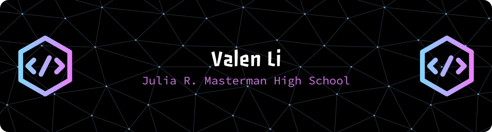

  

<h1 align="center">Welcome to my Github! 😺😸😺😸</h1>

  
  
  

  
  

<h2>About Me:</h2>

I am a student in Philly👌

 - 🔭 I complete projects from time to time as a self-taught programmer. 

 - 🍞 "Gotta love me some good bread." 

 - 🔰 In my freetime, I enjoy watching anime. 

 - 📭 Feel free to reach out to me via LinkedIn. 

<h2>Programming Languages:</h2>

Java, Python, C, C++, LaTeX, JavaScript, HTML/CSS, TypeScript, R

<h2>Frameworks/Libraries:</h2>

Pandas, React/React-native, TensorFlow, OpenCV, Tailwind, Matplotlib, GSAP, Spring Boot

<h2>Developer Tools:</h2>

Git, FFmpeg, GCP, VSCode, Android Studio, Postman, PostgreSQL, IntelliJ, Expo, Vercel, Raven, Mulesoft

<h2>Skills:</h2>

Web/App/Mobile app/Full-Stack Dev, Data Science, Machine Learning, AI, Financial Analysis

---

### :hammer_and_wrench: Languages and Tools :

  &nbsp;
  &nbsp;
  &nbsp;

---

### 📊 GitHub Stats:

  

  

---

### 🔥 Streak Stats:

  

---

### 🏆 GitHub Trophies:

  

---

### 📈 Profile Views:

  

  

