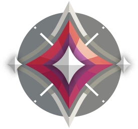

  

<h1 align="center">Welcome to my Github!</h1>

  
  
  

  

<h2>About Me:</h2>

I am a high school student in Philly

 - ⚙️ I complete projects from time to time as a self-taught programmer.

 - ♟️  My hobbies are Poker, Chess, Cubing, Pen spinning, and Computer/Keyboard Building. 

 -  Peak Immortal in Valorant, Sub 13 in Minecraft Speedrunning, Sub 20 3x3 Cubing 

 - 📭 Feel free to reach out to me via LinkedIn or email. 

<h2>Skills:</h2>

Web/App/Mobile app/Full-Stack Dev, Data Science, Machine Learning, AI, Financial Analysis

---

### :hammer_and_wrench: Languages and Tools :

#### Programming Languages:

  &nbsp;
  &nbsp;
  &nbsp;
  &nbsp;
  &nbsp;
  &nbsp;
  &nbsp;
  &nbsp;
  &nbsp;
  &nbsp;

#### Frameworks & Libraries:

  &nbsp;
  &nbsp;
  &nbsp;
  &nbsp;
  &nbsp;
  &nbsp;
  &nbsp;

#### Developer Tools:

  &nbsp;
  &nbsp;
  &nbsp;
  &nbsp;
  &nbsp;
  &nbsp;
  &nbsp;

---

### 📊 GitHub Stats:

  

---

### 🔥 Streak Stats:

  

---
